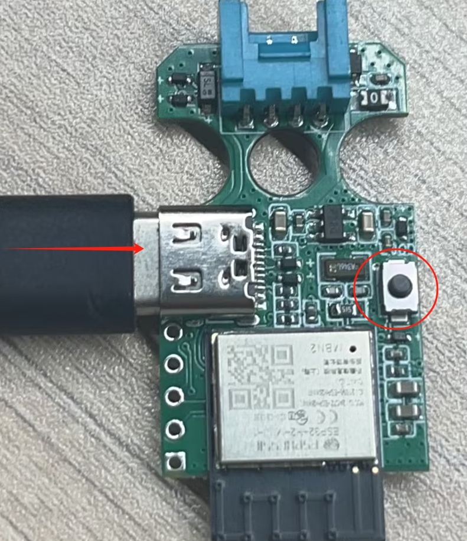
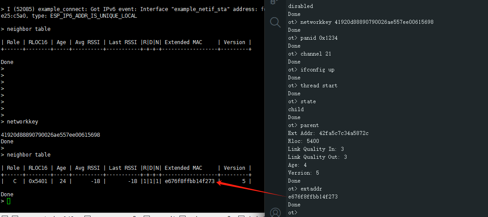

# Unit Gateway H2 + CoreS3 运行 ESP Thread Boarder Router


Unit Gateway H2 支持搭配ESP32系列 Wi-Fi SoC 运行 ESP Thread Boarder Router SDK，该SDK构建基于ESP-IDF和OpenThread，将Thread网络运行在H2上，H2通过串口与主处理器通信。

你需要准备：
- M5Unit-Gateway H2 

  
- M5Stack CoreS3 / M5Stack Core2 / M5Stack Core

  

- BASE DIN / Base M5GO Bottom (带PORT.C口底座)

  
- Type-C 数据线
- ESP-IDF 环境

## 1. 安装 ESP-IDF
```bash
git clone --recursive https://github.com/espressif/esp-idf.git
cd esp-idf
git checkout v5.3.1 # recommend
./install.sh

. ./export.sh
```

## 2. 编译H2 rcp固件
>由于芯片的引脚驱动能力等因素，使用长杜邦线连接时串口有可能无法正常工作，如遇到这种情况请适当降速处理；此处将默认波特率460800降速为230400。
```bash
cd examples/openthread/ot_rcp
vim main/esp_ot_config.h
# 将43行 .baud_rate = 460800; 修改为 .baud_rate = 230400; 保存
idf.py set-target esp32h2
idf.py build
```
<div align=center></div>

按住boot按键后插上Type-C，烧录固件
<div align=center></div>

```bash
idf.py flash
```

## 3. 编译wifi soc固件
>Unit与Module不同，需要关闭rcp烧录，修改波特率，修改串口引脚；对应代码分支已进行修改。

拉取代码
```bash
cd ~
git clone https://github.com/Ocean-lhy/esp-thread-br.git
```

配置soc
```bash
# coreS3
git checkout demo_for_unit_coreS3
cd examples/thread_border_router_credential_sharing
idf.py set-target esp32s3
# core2 v1.0和v1.1的电源管理芯片分别为AXP192和AXP2101，需要在menuconfig中配置
git checkout demo_for_unit_core2
cd examples/thread_border_router_credential_sharing
idf.py set-target esp32
# core
git checkout demo_for_unit_core
cd examples/thread_border_router_credential_sharing
idf.py set-target esp32
```

配置wifi
```bash
idf.py menuconfig
```
在 menuconfig 中配置：
  - Example Connection Configuration
    - 配置 Wi-Fi SSID 和密码

<div align=center></div>

编译烧录固件
```bash
idf.py build
idf.py erase_flash
idf.py flash # 根据实际端口修改
```

# 4. 运行
将core主机插上底座，然后将unit插入PORT.C口，上电，设备正常运行后，m5stack的屏幕上出现以下信息：
1. `Espressif`标志
2. `generate epskc`按钮
3. `factoryreset`按钮
4. Border router web server网址

<div align=center></div>

在m5stack的屏幕上点击`generate epskc`按钮，设备将生成一个epskc，并显示在屏幕上。

在局域网内，使用浏览器访问Border router web server网址，可以查看Thread网络信息。

<div align=center></div>

如果想修改连接的WIFI可以用串口连接指令界面，输入指令`wifi -s SSID -p PASSWORD`，然后重启设备。

# 5. 测试
使用一个ESP32H2(Unit Gateway H2)或ESP32C6(M5NanoC6)，烧录[openthread](../Device/openthread.md)的SimpleCLI例程，连接到Thread网络，查看Thread网络信息。

1. 在ThreadBoarderRouter的后台输入`networkkey`、`panid`、`channel`，获取Thread网络的网络密钥、panid和channel。
2. 在SimpleCLI例程中输入配置命令并启动Thread网络
```bash
networkkey <networkkey>
panid <panid>
channel <channel>
ifconfig up
thread start
```
3. 在SimpleCLI后台输入`state`，查看Thread网络状态，如果作为child/router连接上网络，则Thread网络连接成功。如果作为leader成立网络，则配置可能有误。
4. 在SimpleCLI后台输入`parent`，查看Thread网络的父节点；输入`extaddr`，查看此节点的扩展地址。
5. 在ThreadBoarderRouter的串口后台输入`extaddr`，查看此节点的扩展地址，应与SimpleCLI例程中的`parent extaddr`一致。
6. 在ThreadBoarderRouter的串口后台输入`neighbor table`，查看Thread网络的邻居节点，应包含SimpleCLI例程的节点。

<div align=center></div>
