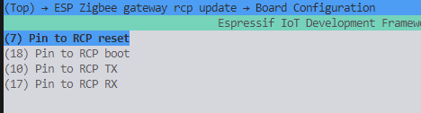
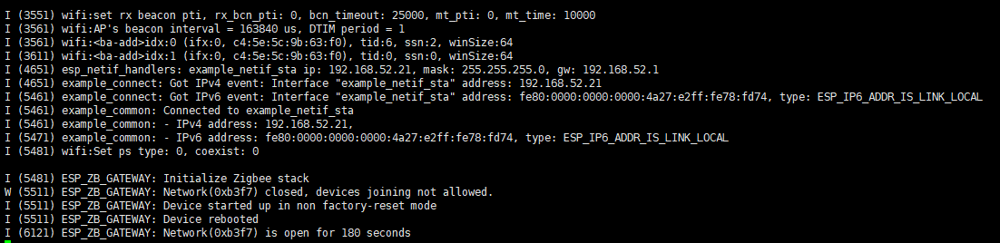

# Unit Gateway H2 + CoreS3 运行 ESP Zigbee Gateway

ESP Zigbee Gateway 是一个基于 ESP32 系列 Wi-Fi SoC 和 ESP32-H2 802.15.4 SoC 的网关设备。它可以将 Zigbee 网络与 Wi-Fi 网络连接起来，实现智能家居设备的互联互通。

## 硬件要求

- M5Unit-Gateway H2（作为 RCP）

  
- M5Stack CoreS3（作为 Host）

   
- BASE DIN / Base M5GO Bottom (带PORT.C口底座)

  
- Type-C 数据线
- ESP-IDF 环境

## 1. 安装 ESP-IDF
```bash
git clone --recursive https://github.com/espressif/esp-idf.git
cd esp-idf
./install.sh

. ./export.sh
```

## 2. 获取 ESP Zigbee SDK
```bash
git clone --recursive https://github.com/espressif/esp-zigbee-sdk.git
cd esp-zigbee-sdk
```

## 3. 编译 RCP 固件

在编译 Gateway 固件之前，需要先生成 RCP 固件。

```bash
cd $IDF_PATH/examples/openthread/ot_rcp
idf.py set-target esp32h2
```

在 menuconfig 中配置：
- Component config → OpenThread RCP Example
  - Enable OPENTHREAD_NCP_VENDOR_HOOK

修改波特率，打开 ```main/esp_ot_config.h``` ，将43行 ```.baud_rate = 460800;``` 修改为 ```.baud_rate = 230400;```。


编译并生成固件：
```bash
idf.py build
```
按住boot按键后插上Type-C，烧录固件

## 4. 编译 Gateway 固件

### 4.1 配置 Gateway
```bash
cd esp-zigbee-sdk/examples/esp_zigbee_gateway
idf.py set-target esp32s3 # 使用 CoreS3
idf.py menuconfig
```

在 menuconfig 中配置：
- ESP Zigbee gateway rcp update
  - Board Configuration
    - Pin to RCP reset: -1
    - Pin to RCP boot: -1
    - Pin to RCP TX: 18
    - Pin to RCP RX: 17

  <div align=center></div>

- Example Connection Configuration
  - WiFi SSID
  - WiFi Password
  
  <div align=center></div>

修改波特率，打开```main/esp_zigbee_gateway.h```，将```.baud_rate = 460800```修改为```.baud_rate = 230400```。

### 4.2 编译和烧录
```bash
idf.py build
idf.py erase_flash
idf.py flash # 根据实际端口修改
```

## 5. 运行

1. 将 底座 插入 CoreS3， 将 Unit 插入底座
2. 将 CoreS3 连接电脑
3. 运行监视器：`idf.py monitor`

正常运行时可以看到以下日志：
- Wi-Fi 连接成功
- Zigbee 网络创建成功
- 网络开放允许设备加入

<div align=center></div>
