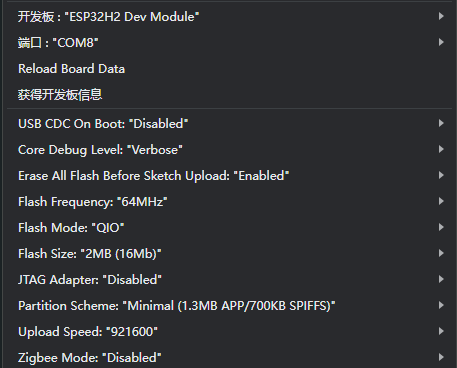
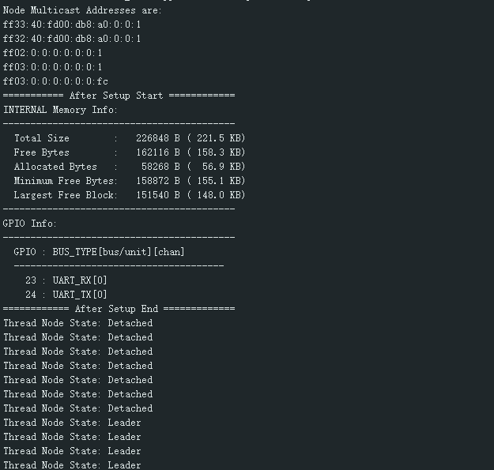
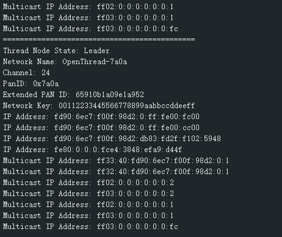
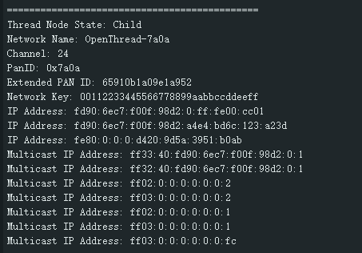
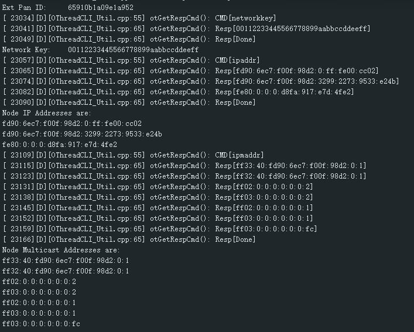
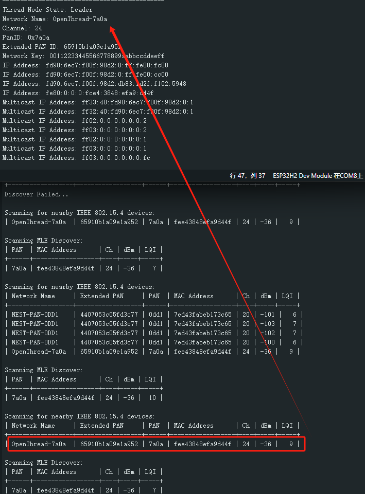

# M5Stack Gateway H2 OpenThread Arduino Library 例程使用指南

本指南介绍如何使用 M5Stack Gateway H2 运行 espressif 提供的 OpenThread Arduino Library 例程。这些例程展示了如何使用 M5Stack 设备进行 Thread 网络通信。

## 准备工作

### 硬件要求
- M5Stack Unit Gateway H2

  
- Type-C 数据线

### 软件环境
1. Arduino IDE
2. 开发板管理器 esp32 >= 3.1.0
3. OpenThread Arduino Library

### 基本配置步骤
1. 打开 Arduino IDE
2. 点击示例：`File -> Examples -> OpenThread`
3. 选择正确的开发板：`Tools -> Board: ESP32H2 Dev Module`
4. 选择flash大小：`Tools -> Flash Size: 2MB`
5. 选择分区方案：`Tools -> Partition Scheme: Minimal SPIFFS (1.3MB APP/700K SPIFFS)`
6. 选择正确的串口：`Tools -> Port`
7. 烧录固件到设备
8. 设备将自动启动并尝试加入网络
9. 通过串口监视器查看网络状态

## 例程说明

### 1. 简单节点 (SimpleNode)

这个例程展示了如何创建一个基本的 Thread 节点。

#### 功能说明
- 自动启动并加入 Thread 网络。没有对应的Thread网络时，启动为Leader节点。
- 使用默认网络配置：
  - 网络名称：OpenThread-ESP
  - 网络前缀：fd00:db8:a0:0::/64
  - 网络信道：15
  - PAN ID：0x1234
  - 扩展 PAN ID：dead00beef00cafe
  - 网络密钥：00112233445566778899aabbccddeeff
- 每5秒显示一次节点状态
- 支持从 NVS 加载已保存的网络配置

### 2. Thread 网络 (SimpleThreadNetwork)

这个例程展示了如何建立一个完整的 Thread 网络，包含三种不同类型的节点。

#### 2.1 Leader 节点 (LeaderNode)
- 作为网络的第一个设备创建并管理 Thread 网络
- 提供完整的网络数据集
- 显示详细的网络信息：
  - 网络名称
  - 信道
  - PAN ID
  - 扩展 PAN ID
  - 网络密钥
  - IP 地址
  - 多播地址

#### 2.2 Router 节点 (RouterNode)
- 加入现有的 Thread 网络，转发网络数据
- 显示连接状态和网络信息

#### 2.3 扩展路由器节点 (ExtendedRouterNode)
- 支持更多的路由功能，可以作为 Router 或 Child 运行
- 提供网络诊断信息

### 3. 网络扫描 (ThreadScan)

这个例程展示了如何扫描周围的 Thread 网络。

#### 功能说明
- 扫描 IEEE 802.15.4 设备
  - 显示设备地址
  - 显示信号强度
  - 显示信道信息
- 扫描 Thread 网络（需要设备至少是 Child 状态）
  - 显示网络名称
  - 显示扩展 PAN ID
  - 显示 RLOC16
  - 显示版本信息
- 支持持续扫描模式

### 4. CLI 控制台 (SimpleCLI)

这个例程提供了一个完整的 OpenThread CLI 控制台。

#### 功能说明
- 提供完整的 CLI 命令接口
- 支持所有 OpenThread CLI 命令：
  - 网络管理命令
  - 设备配置命令
  - 诊断命令
  - 安全命令
- 实时命令响应
- 支持命令历史
- 方便调试和配置

### 5. 接收回调 (onReceive)

这个例程展示了如何使用回调函数处理 CLI 响应。

#### 功能说明
- 捕获 CLI 响应
- 自定义响应处理
- 状态监控
- 支持异步处理
