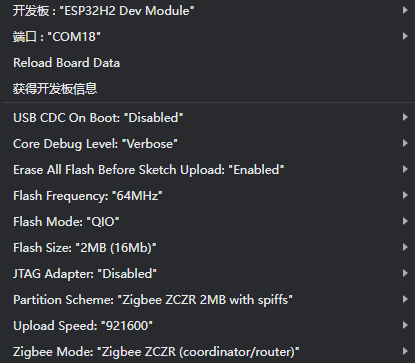
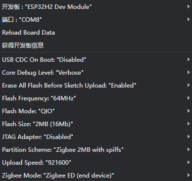
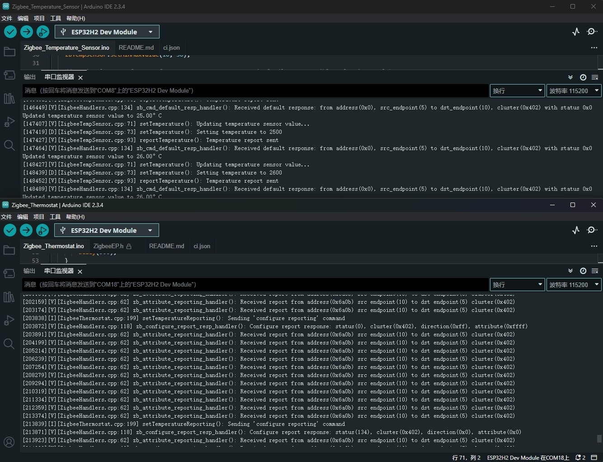
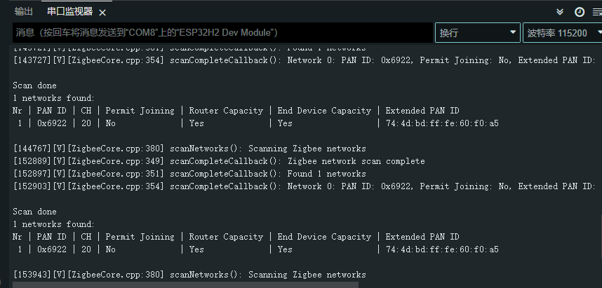

# M5Stack Gateway H2 Zigbee Arduino Library 例程使用指南

本指南介绍如何使用 M5Stack Gateway H2 运行 espressif 提供的 Zigbee Arduino Library 例程。这些例程展示了如何使用 M5Stack 设备进行 Zigbee 网络通信。

## 准备工作

### 硬件要求
- M5Stack Unit Gateway H2

  
- Type-C 数据线

### 软件环境
1. Arduino IDE
2. 开发板管理器 esp32 >= 3.1.0, URL: https://espressif.github.io/arduino-esp32/package_esp32_index.json
3. 添加zigbee 2MB flash partition scheme: 
    - 3.1 打开 Arduino IDE 的 .arduinoIDE/arduino-cli.yaml，打开其中的data地址。
    - 3.2 打开 data 地址下的 packages\esp32\hardware\esp32\3.1.0\boards.txt 文件，在esp32h2处添加以下内容：
    ```
    esp32h2.menu.PartitionScheme.zigbee_2MB=Zigbee 2MB with spiffs
    esp32h2.menu.PartitionScheme.zigbee_2MB.build.partitions=zigbee_2MB
    esp32h2.menu.PartitionScheme.zigbee_2MB.upload.maximum_size=1310720
    esp32h2.menu.PartitionScheme.zigbee_zczr_2MB=Zigbee ZCZR 2MB with spiffs
    esp32h2.menu.PartitionScheme.zigbee_zczr_2MB.build.partitions=zigbee_zczr_2MB
    esp32h2.menu.PartitionScheme.zigbee_zczr_2MB.upload.maximum_size=1310720
    ```
    - 3.3 打开 data 地址下的 packages\esp32\hardware\esp32\3.1.0\tools\partitions ，在分区表中添加两个新文件：
    zigbee_2MB.csv
    ```
    # Name,     Type, SubType, Offset,  Size, Flags
    nvs,        data, nvs,     0x9000,  0x5000,
    otadata,    data, ota,     0xe000,  0x2000,
    app0,       app,  ota_0,   0x10000, 0xC0000,
    app1,       app,  ota_1,   0xd0000, 0xC0000,
    spiffs,     data, spiffs,  0x190000,0x5a000,
    zb_storage, data, fat,     0x1ea000,0x4000,
    zb_fct,     data, fat,     0x1ee000,0x1000,
    coredump,   data, coredump,0x1f0000,0x10000,
    ```
    zigbee_zczr_2MB.csv
    ```
    # Name,     Type, SubType, Offset,  Size, Flags
    nvs,        data, nvs,     0x9000,  0x5000,
    otadata,    data, ota,     0xe000,  0x2000,
    app0,       app,  ota_0,   0x10000, 0xC0000,
    app1,       app,  ota_1,   0xd0000, 0xC0000,
    spiffs,     data, spiffs,  0x190000,0x5a000,
    zb_storage, data, fat,     0x1ea000,0x4000,
    zb_fct,     data, fat,     0x1ee000,0x1000,
    rcp_fw,     data, spiffs,  0x1ef000,0x1000,
    coredump,   data, coredump,0x1f0000,0x10000,
    ```
    - 3.4 点击reload board data

## 例程说明

### 1. Zigbee 恒温器 (Zigbee/Zigbee_Thermostat)

这个例程展示了如何配置 Zigbee 协调器并将其用作家庭自动化（HA）恒温器。

#### 功能说明
- 作为 Zigbee 协调器运行
- 接收温度传感器数据
- 配置温度传感器的报告间隔
- 串口打印温度和配置信息

#### 硬件要求
- 一块M5Stack Unit Gateway H2作为 Zigbee 协调器（运行此恒温器例程）
- 一块M5Stack Unit Gateway H2作为 Zigbee 终端设备（运行温度传感器例程）

#### 配置说明

Arduino IDE 工具菜单配置：
- 选择正确的开发板：`Tools -> Board: ESP32H2 Dev Module`
- 选择开启擦除：`Tools -> Erase All Flash Before Sketch Upload: Enable` (不开启可能导致连接失败)
- 选择flash大小：`Tools -> Flash Size: 2MB`
- 选择协调器模式：`Tools -> Zigbee mode: Zigbee ZCZR (coordinator/router)`
- 选择 Zigbee 分区方案：`Tools -> Partition Scheme: Zigbee 2MB with spiffs`
- 选择正确的串口：`Tools -> Port`

<div align=center></div>

#### 代码示例 (Copy from the official routine)

```cpp
#ifndef ZIGBEE_MODE_ZCZR
#error "Zigbee coordinator mode is not selected in Tools->Zigbee mode"
#endif
#include "Zigbee.h"

#define THERMOSTAT_ENDPOINT_NUMBER 5

ZigbeeThermostat zbThermostat = ZigbeeThermostat(THERMOSTAT_ENDPOINT_NUMBER);

float sensor_temp;
float sensor_max_temp;
float sensor_min_temp;
float sensor_tolerance;

void recieveSensorTemp(float temperature) {
    Serial.printf("Temperature sensor value: %.2f°C\n", temperature);
    sensor_temp = temperature;
}

void recieveSensorConfig(float min_temp, float max_temp, float tolerance) {
    Serial.printf("Temperature sensor settings: min %.2f°C, max %.2f°C, tolerance %.2f°C\n", 
                  min_temp, max_temp, tolerance);
    sensor_min_temp = min_temp;
    sensor_max_temp = max_temp;
    sensor_tolerance = tolerance;
}

void setup() {
    // Set callback functions for temperature and configuration receive
    zbThermostat.onTempRecieve(recieveSensorTemp);
    zbThermostat.onConfigRecieve(recieveSensorConfig);

    //Optional: set Zigbee device name and model
    zbThermostat.setManufacturerAndModel("Espressif", "ZigbeeThermostat");

    //Add endpoint to Zigbee Core
    Zigbee.addEndpoint(&zbThermostat);

    //Open network for 180 seconds after boot
    Zigbee.setRebootOpenNetwork(180);

    // When all EPs are registered, start Zigbee with ZIGBEE_COORDINATOR mode
    if (!Zigbee.begin(ZIGBEE_COORDINATOR)) {
        Serial.println("Zigbee failed to start!");
        Serial.println("Rebooting...");
        ESP.restart();
    }

    Serial.println("Waiting for Temperature sensor to bound to the thermostat");
    while (!zbThermostat.bound()) {
        Serial.printf(".");
        delay(500);
    }

    Serial.println();

    // Get temperature sensor configuration
    zbThermostat.getSensorSettings();
}

void loop() {
    // Print temperature sensor data each 10 seconds
    static uint32_t last_print = 0;
    if (millis() - last_print > 10000) {
        last_print = millis();
        // Set reporting interval for temperature sensor
        zbThermostat.setTemperatureReporting(0, 10, 2);
        int temp_percent = (int)((sensor_temp - sensor_min_temp) / (sensor_max_temp - sensor_min_temp) * 100);
        Serial.printf("Loop temperature info: %.2f°C (%d %%)\n", sensor_temp, temp_percent);
    }
}
```

#### 使用步骤

1. 将恒温器代码烧录到协调器Coordinator设备
2. 将温度传感器代码烧录到终端设备End Device
3. 协调器启动后会自动创建网络并等待设备加入，每 10 秒会打印一次当前温度信息
4. 查看串口监视器中的温度数据，观察温度变化时的自动报告，检查配置信息是否正确接收


### 2. Zigbee 温度传感器 (Zigbee/Zigbee_Temperature_Sensor)

这个例程展示了如何配置 Zigbee 终端设备并将其用作家庭自动化（HA）温度传感器。

#### 功能说明
- 作为 Zigbee 终端设备运行
- 读取芯片温度数据
- 定期向协调器报告温度
- 支持按需温度上报

#### 配置说明

Arduino IDE 工具菜单配置：
- 选择正确的开发板：`Tools -> Board`
- 选择开启擦除：`Tools -> Erase All Flash Before Sketch Upload: Enable` (不开启可能导致连接失败)
- 选择终端设备模式：`Tools -> Zigbee mode: Zigbee ED (end device)`
- 选择 Zigbee 分区方案：`Tools -> Partition Scheme: Zigbee 2MB with spiffs`

<div align=center></div>

#### 代码示例 (Copy from the official routine)

```cpp
#ifndef ZIGBEE_MODE_ED
#error "Zigbee end device mode is not selected in Tools->Zigbee mode"
#endif
#include "Zigbee.h"

#define TEMP_SENSOR_ENDPOINT_NUMBER 10

ZigbeeTempSensor zbTempSensor = ZigbeeTempSensor(TEMP_SENSOR_ENDPOINT_NUMBER);

/************************ Temp sensor *****************************/
static void temp_sensor_value_update(void *arg) {
    for (;;) {
        // Read temperature sensor value
        float tsens_value = temperatureRead();
        Serial.printf("Updated temperature sensor value to %.2f°C\r\n", tsens_value);
        // Update temperature value in Temperature sensor EP
        zbTempSensor.setTemperature(tsens_value);
        delay(1000);
    }
}

/********************* Arduino functions **************************/
void setup() {
    Serial.begin(115200);

    // Optional: set Zigbee device name and model
    zbTempSensor.setManufacturerAndModel("Espressif", "ZigbeeTempSensor");

    // Set minimum and maximum temperature measurement value (10-50°C is default range for chip temperature measurement)
    zbTempSensor.setMinMaxValue(10, 50);

    // Optional: Set tolerance for temperature measurement in °C (lowest possible value is 0.01°C)
    zbTempSensor.setTolerance(1);

    // Add endpoint to Zigbee Core
    Zigbee.addEndpoint(&zbTempSensor);

    Serial.println("Starting Zigbee...");
    // When all EPs are registered, start Zigbee in End Device mode
    if (!Zigbee.begin()) {
        Serial.println("Zigbee failed to start!");
        Serial.println("Rebooting...");
        ESP.restart();
    } else {
        Serial.println("Zigbee started successfully!");
    }
    Serial.println("Connecting to network");
    while (!Zigbee.connected()) {
        Serial.print(".");
        delay(100);
    }
    Serial.println();

    // Start Temperature sensor reading task
    xTaskCreate(temp_sensor_value_update, "temp_sensor_update", 2048, NULL, 10, NULL);

    // Set reporting interval for temperature measurement in seconds, must be called after Zigbee.begin()
    // min_interval and max_interval in seconds, delta (temp change in 0,1 °C)
    // if min = 1 and max = 0, reporting is sent only when temperature changes by delta
    // if min = 0 and max = 10, reporting is sent every 10 seconds or temperature changes by delta
    // if min = 0, max = 10 and delta = 0, reporting is sent every 10 seconds regardless of temperature change
    zbTempSensor.setReporting(1, 0, 1);
}

void loop() {
    zbTempSensor.reportTemperature();
    delay(1000);
}
```

#### 使用步骤

1. 确保协调器已经运行并创建网络，将温度传感器代码烧录到终端设备
2. 设备启动后会自动搜索并加入网络，每秒读取一次温度数据，当温度变化超过1°C时自动上报

<div align=center></div>

### 3. Zigbee 网络扫描 (Zigbee/Zigbee_Scan_Networks)

这个例程展示了如何扫描周围的 Zigbee 网络。

#### 功能说明
- 扫描可用的 Zigbee 网络
- 显示网络详细信息
- 支持周期性扫描

#### 配置说明

工具菜单配置：
- 可以选择任意 Zigbee 模式
- 选择正确的分区方案

#### 代码示例 (Copy from the official routine)

```cpp
#if !defined(ZIGBEE_MODE_ED) && !defined(ZIGBEE_MODE_ZCZR)
#error "Zigbee device mode is not selected in Tools->Zigbee mode"
#endif

#include "Zigbee.h"

#ifdef ZIGBEE_MODE_ZCZR
zigbee_role_t role = ZIGBEE_ROUTER;  // or can be ZIGBEE_COORDINATOR, but it won't scan itself
#else
zigbee_role_t role = ZIGBEE_END_DEVICE;
#endif

void printScannedNetworks(uint16_t networksFound) {
    if (networksFound == 0) {
        Serial.println("No networks found");
    } else {
        zigbee_scan_result_t *scan_result = Zigbee.getScanResult();
        Serial.println("\nScan done");
        Serial.print(networksFound);
        Serial.println(" networks found:");
        Serial.println("Nr | PAN ID | CH | Permit Joining | Router Capacity | End Device Capacity | Extended PAN ID");
        for (int i = 0; i < networksFound; ++i) {
        // Print all available info for each network found
        Serial.printf("%2d", i + 1);
        Serial.print(" | ");
        Serial.printf("0x%04hx", scan_result[i].short_pan_id);
        Serial.print(" | ");
        Serial.printf("%2d", scan_result[i].logic_channel);
        Serial.print(" | ");
        Serial.printf("%-14.14s", scan_result[i].permit_joining ? "Yes" : "No");
        Serial.print(" | ");
        Serial.printf("%-15.15s", scan_result[i].router_capacity ? "Yes" : "No");
        Serial.print(" | ");
        Serial.printf("%-19.19s", scan_result[i].end_device_capacity ? "Yes" : "No");
        Serial.print(" | ");
        Serial.printf(
            "%02x:%02x:%02x:%02x:%02x:%02x:%02x:%02x", scan_result[i].extended_pan_id[7], scan_result[i].extended_pan_id[6], scan_result[i].extended_pan_id[5],
            scan_result[i].extended_pan_id[4], scan_result[i].extended_pan_id[3], scan_result[i].extended_pan_id[2], scan_result[i].extended_pan_id[1],
            scan_result[i].extended_pan_id[0]
        );
        Serial.println();
        delay(10);
        }
        Serial.println("");
        // Delete the scan result to free memory for code below.
        Zigbee.scanDelete();
    }
}

void setup() {
    Serial.begin(115200);

    // Initialize Zigbee stack without any EPs just for scanning
    if (!Zigbee.begin(role)) {
        Serial.println("Zigbee failed to start!");
        Serial.println("Rebooting...");
        ESP.restart();
    }

    Serial.println("Setup done, starting Zigbee network scan...");
    // Start Zigbee Network Scan with default parameters (all channels, scan time 5)
    Zigbee.scanNetworks();
}

void loop() {
    // check Zigbee Network Scan process
    int16_t ZigbeeScanStatus = Zigbee.scanComplete();
    if (ZigbeeScanStatus < 0) {  // it is busy scanning or got an error
        if (ZigbeeScanStatus == ZB_SCAN_FAILED) {
        Serial.println("Zigbee scan has failed. Starting again.");
        delay(1000);
        Zigbee.scanNetworks();
        }
        delay(100);
        // other option is status ZB_SCAN_RUNNING - just wait.
    } else {  // Found Zero or more Wireless Networks
        printScannedNetworks(ZigbeeScanStatus);
        delay(1000);
        Zigbee.scanNetworks();  // start over...
    }
    // Loop can do something else...
}
```

#### 使用步骤

1. 确保周围有活跃的 Zigbee 网络，将扫描代码烧录到设备
2. 设备启动后自动开始扫描，每次扫描完成后显示结果，并自动开始下一轮扫描

<div align=center></div>